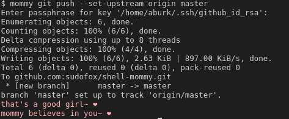

# sudofox/shell-daddy

Inspired by [Gankra/cargo-daddy](https://github.com/Gankra/cargo-daddy)

This is a shell script that provides a `daddy` function which emulates a nurturing and supportive figure. The `daddy` function can be used to offer praise and encouraging responses to a user's actions, depending on the exit status of the command that is passed to it.

By default, the text will be output in a light pink to stderr. You can change this to a light blue if you find that more encouraging.

</a>


I hope this will serve to improve the efficiency of your workflow and general mental health. Please use responsibly.

## Installation

To use the `daddy` function, you can source the `shell-daddy.sh` script in your current shell or add it to your `~/.bashrc` file to have it available every time you open a new terminal.

```
. /path/to/shell-daddy.sh
```

If you'd like it to always show a message after each command, you can define a custom `PROMPT_COMMAND` like so:

```
export PROMPT_COMMAND="daddy \\$\\(exit \$?\\); $PROMPT_COMMAND"
```

## Configuration

The `daddy` function has several customizable options that can be set using environment variables:

- `SHELL_daddyS_LITTLE`: Sets the affectionate term that `daddy` will use to refer to the user. The default value is "girl".
- `SHELL_daddyS_PRONOUNS`: Sets the pronouns that `daddy` will use to refer to itself. The default value is "her".
- `SHELL_daddyS_ROLES`: Sets the role that `daddy` will have. The default value is "daddy".
- `SHELL_daddyS_COLOR`: Sets the color of the text output by `daddy`. The default value is a light pink color.
- `SHELL_daddyS_ONLY_NEGATIVE`: If set to `true`, `daddy` will provide encouragement (on non-zero exit status) but not praise. This will keep clutter down if you intend to use `daddy` as a `PROMPT_COMMAND`.
- `SHELL_daddyS_NEGATIVE_RESPONSES`/`SHELL_daddyS_POSITIVE_RESPONSES`: Sets the possible responses that `daddy` will use. This should be in the form of a bash array and will override the default responses. Want Samuel L. Jackson to chastise or compliment you? [Now you can!](https://github.com/sudofox/shell-daddy/issues/5#issuecomment-1381029744)

To add multiple possible values, separate them with a forward slash, for example:

```sh
export SHELL_daddyS_LITTLE="child/girl/boy"
# ...
$ daddy ls
README.md  shell-daddy.sh
awe, what a good boy~
daddy knew you could do it~ ❤️
$ daddy ls
README.md  shell-daddy.sh
good girl~
daddy's so proud of you~ ❤️
$ daddy ls
README.md  shell-daddy.sh
daddy thinks her little child earned a big hug~ ❤️
```

## Usage

To use the `daddy` function, simply pass a command as an argument and `daddy` will provide a supportive response based on the exit status of the command. Depending on the exit status, `daddy` will provide a response of praise or encouragement.

```sh
daddy ls
# Output: Good girl! daddy's so proud of you! ❤️

daddy this-command-does-not-exist
# Output: Just a little further, sweetie~ ❤️
```

## Example

```
# Set custom affectionate term and pronouns
export SHELL_daddyS_LITTLE="kiddo"
export SHELL_daddyS_PRONOUNS="them"

# Use the daddy function to run a command
daddy ls

# Output:
# That's a good kiddo~ ❤️
```
